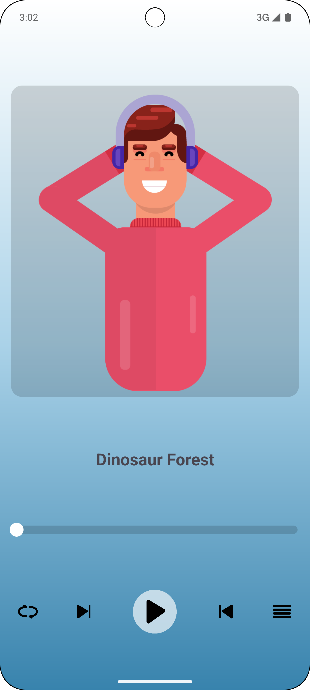
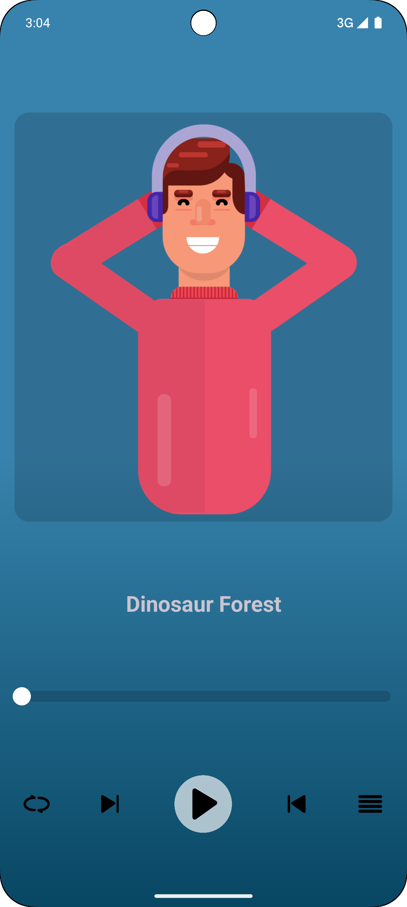

# CalmSphere

## Project Overview
**CalmSphere** is a simple audio player mobile application designed to play relaxing sounds. The app allows users to enjoy a calming experience with features such as **play, pause, forward, and backward controls.** It is built using **Android Java** to practice working with the **MediaPlayer API.**

Currently, CalmSphere offers **two soothing sounds**, with plans to expand the audio collection and enhance user interaction features.

---

## Features
- **Core Audio Player Controls**
    - Play and pause sounds.
    - Go forward to the next sound.
    - Go backward to the previous sound.

- **Upcoming Features (In Progress)**
    - **Loop Button:** Enable continuous playback for any selected sound.
    - **Menu Button:** Display all available sounds for quick selection.

---

## Future Enhancements
- **Enhanced Sound Library:** Add more relaxing sounds, including nature sounds and meditation tracks.
- **Dynamic Playlist:** Allow users to create custom sound playlists.
- **Sound Categories:** Organize sounds into categories for better navigation.
- **Sleep Timer:** Automatically stop playback after a user-defined duration.

---

## Technologies Used
- **Android Studio** for development
- **Java** for backend logic
- **MediaPlayer API** for audio playback

---

## How to Run the Project
1. Clone this repository to your local machine.
2. Open the project in Android Studio.
3. Connect a physical Android device or use an emulator.
4. Build and run the project.

---

## Screenshots
- **Home Screen (Light)**  
  
  _Simple and intuitive audio control interface._

- **Home Screen (Dark)**  
  

---

## Purpose
This project was developed as part of an Android Java practice session to explore the **MediaPlayer API** and build a user-friendly audio player app with essential audio controls. It serves as a stepping stone for more advanced media applications.  
